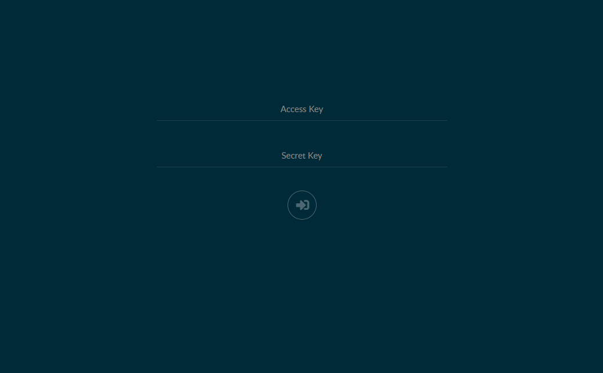

# 华中科技大学对象存储系统实验报告
计科校交 1801  
车春池  
U201816030  
2021-6-17  

  - [实验目的](#实验目的)
  - [实验背景](#实验背景)
  - [Rust，新时代的系统编程语言](#rust新时代的系统编程语言)
  - [实验环境](#实验环境)
  - [实验内容](#实验内容)
  - [实验过程](#实验过程)
    - [Minio 环境搭建](#minio-环境搭建)
    - [s3-bench-rs 实现](#s3-bench-rs-实现)
      - [Task trait 和 TaskBuilder trait](#task-trait-和-taskbuilder-trait)
      - [GetTask 和 GetTaskBuilder 的实现](#gettask-和-gettaskbuilder-的实现)
      - [在 tokio 异步运行时中运行](#在-tokio-异步运行时中运行)
    - [性能测试](#性能测试)
  - [实验总结](#实验总结)


## 实验目的
* 熟悉对象存储技术，代表性系统及其特性
* 实践对象存储系统，部署实验环境，进行初步测试
* 基于对象存储系统，架设实际应用，示范主要功能

## 实验背景
对象存储是一种计算机数据存储结构，它将数据管理为对象，而不是像文件系统那样管理数据作为文件层次结构的其他存储架构，以及将数据作为扇区和路径中的块来管理数据的块存储。  
每个对象通常包括对象本身，一个变量元数据和一个全局唯一标识符。  
对象存储可以在多个级别实现，包括设备级别，系统级别和接口级别。在每种情况下，对象存储都试图启用其他存储架构所没有处理的功能，比如可以通过应用程序直接编程的接口，一个可以跨越物理硬件多个实例的名称空间，以及数据管理功能，如数据复制和对象级粒度的数据分布。  
本次实验基于 `Minio`，一个 Apache License v2.0 开源协议的对象存储系统服务进行。该系统兼容 AWS S3 云存储服务接口，非常适合于存储大容量非结构化的数据。  
在 `Minio` 的基础上，笔者使用 Rust 语言重写了一个针对亚马逊 S3 云存储服务的性能测试程序，并在 `Minio` 系统上进行了测试，完成了实验二。  

## Rust，新时代的系统编程语言
在传统系统编程领域，比如操作系统，嵌入式开发，C/C++ 占据领导地位，因其可以做到精准控制内存，并且拥有非常小的运行时，相比之下 Java/Python 这些运行时中带有 GC 机制的编程语言大多用于应用编程领域，不适用于系统编程。  
C/C++ 虽然运行时极小，但是由于缺乏规范的内存管理机制，一直以来都被诟病内存安全问题，比如悬浮指针，二次释放问题。  
一直以来编程语言都在**高效运行时**和**安全性**之间做权衡，但以往的大部分编程语言都只是偏向于其中一方，要不是追求高性能，安全性问题交给程序员解决，要不是通过 GC 机制管理内存，但性能由此下降。  
Rust 语言则做到了同时兼顾高性能和内存安全，它通过独特的语法机制，比如说所有权和生命周期机制，既做到了管理内存也做到了较小运行时。它一样可以精准控制内存，并且是在保证安全的情况下。  
Rust 正在系统编程领域，比如操作系统，嵌入式，数据库开发等领域中，发挥它的作用。  
## 实验环境
操作系统：WSL2  
```
Linux DESKTOP-LD8BM4D 5.4.72-microsoft-standard-WSL2 #1 SMP Wed Oct 28 23:40:43 UTC 2020 x86_64 x86_64 x86_64 GNU/Linux
```

Rust 环境：1.52.1  
```bash
$ rustc --version
rustc 1.52.1 (9bc8c42bb 2021-05-09)
```

Minio 版本：  
```bash
$ ./minio --version
minio version RELEASE.2021-06-09T18-51-39Z
```

## 实验内容
* 搭建 `Minio` 环境
* 编写 `s3-bench-rs`
* 使用 `s3-bench-rs` 测试 `Minio` 性能，并进行分析
## 实验过程
### Minio 环境搭建
直接下载二进制文件：  
```bash
$ wget https://dl.min.io/server/minio/release/linux-amd64/minio
```

添加执行权限：  
```bash
$ sudo chmod +x minio
```

配置 ~/.zshrc 文件：  
```
export MINIO_ACCESS_KEY=ccc
export MINIO_SECRET_KEY=WXZFwxzf123
```

运行 Minio:  
```bash
$ ./minio server data
```

运行结果：  
```
Endpoint: http://172.25.42.33:9000  http://127.0.0.1:9000
RootUser: ccc
RootPass: WXZFwxzf123

Browser Access:
   http://172.25.42.33:9000  http://127.0.0.1:9000

Command-line Access: https://docs.min.io/docs/minio-client-quickstart-guide
   $ mc alias set myminio http://172.25.42.33:9000 ccc WXZFwxzf123

Object API (Amazon S3 compatible):
   Go:         https://docs.min.io/docs/golang-client-quickstart-guide
   Java:       https://docs.min.io/docs/java-client-quickstart-guide
   Python:     https://docs.min.io/docs/python-client-quickstart-guide
   JavaScript: https://docs.min.io/docs/javascript-client-quickstart-guide
   .NET:       https://docs.min.io/docs/dotnet-client-quickstart-guide
IAM initialization complete
```

在浏览器打开上面的链接，进入登录画面：  
  

输入公钥和密钥，登录进去：  
  

尝试创建一些 `Bucket` 和上传一些文件，Minio 环境搭建基本完成。  

### s3-bench-rs 实现
`s3-bench-rs` 基于 `rusty-s3` 开源库和 `tokio` 异步运行时编写，将测试成为抽象成`任务`，方便进行性能测试。  
本项目的实现细节涉及 Rust 语言的内存管理机制和异步语法，本文对于这两部分内容不会进行补充，这里给出相关链接：  
* 所有权机制: <https://kaisery.github.io/trpl-zh-cn/ch04-01-what-is-ownership.html>
* 生命周期机制: <https://kaisery.github.io/trpl-zh-cn/ch10-03-lifetime-syntax.html>
* 异步运行时: <https://rust-lang.github.io/async-book/>

下面将介绍一下 `s3-bench-rs` 的设计思路。  
#### Task trait 和 TaskBuilder trait
由于我们想将测试抽象成`任务`来进行，于是我们定义一个 trait:  
```Rust
#[async_trait]
pub trait Task {
    type R: Sized;
    /// 夺取任务的所有权去运行，运行完毕后释放内存空间
    async fn run(self) -> Result<Self::R, Box<StdError>>;
}
```
这个 trait 中有一个异步方法，这个方法夺取任务的所有权去运行，这样子运行完毕之后系统就会自动释放它占用的内存空间。  
然后我们需要有一个结构，不断生成测试任务去执行，因此我们再定义一个 trait:  
```Rust
pub trait TaskBuiler {
    type R: Sized;
    type T: Task<R = Self::R>;
    type I: IntoIterator<Item = Self::T, IntoIter = std::vec::IntoIter<Self::T>>;
    fn spawn(&self, bucket: &str, object: &str) -> Self::T;
    fn spawn_tier(&self) -> Self::I;
}
```
这个 trait 有两个方法，一个是 spawn 方法，它接受两个参数然后生成一个任务；另一个是 spawn_iter 方法，它不接受任何外部参数，会产生一个任务的**迭代器**，换而言之就是**任务的集合**。  
到这里抽象工作基本完成。  
这里有的读者可能会有个问题：为什么需要这两个抽象？有必要弄得这么复杂吗？  
答案是这些 trait 都是为了提高代码的兼容性，不同的应用场景的具体实现不一样，如何统一这些不同的实现，就需要 trait 对其进行统一的抽象。有了上面这两个 trait，后面添加新的功能将会比较方便。  

#### GetTask 和 GetTaskBuilder 的实现
这里不会讲详细的具体实现，而是会说明如何为 `GetTask` 实现 `Task` trait 和如何为 `GetTaskBuilder` 实现 `TaskBuiler` trait。  
首先 GetTask 里面会保存三个数据：bucket, credentials(由公钥和密钥生成) 和 object(对象名称)，然后这些数据占用的内存空间在任务运行完成之后会被释放。下面代码为 GetTask 实现 Task trait:  
```Rust
#[async_trait]
impl Task for GetTask {
    type R = String; // 返回值为 String
    async fn run(self) -> Result<Self::R, Box<StdError>> {
        let signed_url = self.signed_url(); // 获得 url 链接
        let client = Client::new(); // 生成一个客户端
        let resp = client.get(signed_url).send().await?.error_for_status()?; // 向服务器提交 get 请求
        Ok(resp.text().await?) // 返回服务器回应
    }
}
```

然后下面是 GetTaskBuilder 的定义：  
```Rust
pub struct GetTaskBuilder {
    endpoint: Url, // 创建对象存储服务时候的 endpoint，在 minio 中会自动生成
    key: String, // 公钥
    secret: String, // 密钥
    region: String, // 地区，可忽略
    pool: Vec<(String, String)>, // (bucket, object) 的集合
}
```
为 GetTaskBuilder 实现 TaskBuilder trait:  
```Rust
impl TaskBuiler for GetTaskBuilder {
    type R = String;
    type T = GetTask;
    type I = Vec<GetTask>;
    fn spawn(&self, bucket: &str, object: &str) -> Self::T {
        let bucket =
            Bucket::new(self.endpoint.clone(), true, bucket, self.region.as_str()).unwrap();
        let credentials = Credentials::new(self.key.clone(), self.secret.clone());
        GetTask(SingleTask::new(bucket, credentials, object))
    }

    fn spawn_tier(&self) -> Self::I {
        self.pool
            .iter()
            .map(|(bucket, object)| self.spawn(bucket.as_str(), object.as_str()))
            .collect()
    }
}
```
可以看到是 GetTaskBuilder 通过自身的参数和输入的参数生成了 GetTask 所需要的参数，然后生成 GetTask，因此被称为“构建器”。  

#### 在 tokio 异步运行时中运行
因为 Task trait 中的 run 方法是 async 方法，因此我们可以实现了这个 trait 的结构体放到异步运行时中运行：  
```Rust
#[tokio::main]
async fn main() -> Result<(), Box<StdError>> {
   // 获得一个任务构建器
   let mut get_task_builer = GetTaskBuilder::new(
      "http://172.22.110.215:9000".parse::<Url>().unwrap(),
      "ccc",
      "WXZFwxzf123",
      "minio",
   );
   // 生成一个任务
   let task = get_task_builer.spawn("bucket0", "test.md");
   let text = task.run().await?;
   println!("{}", text);
   // 添加两个任务
   get_task_builer.append_task("bucket1", "test0.txt");
   get_task_builer.append_task("bucket1", "test1.txt");
   let mut tasks = get_task_builer.spawn_tier();
   // 从迭代器里面拿出任务来运行
   while let Some(task) = tasks.pop() {
      let text = task.run().await?;
      println!("{}", text);
   }
   Ok(())
}
```
在 Rust 语言里面异步运行时非常灵活，标准库只提供 Future 抽象，而具体的异步运行时都由第三方库提供，这样子使得我们开发者可以随意编写自己的运行时。  
这里是在 `tokio` 异步运行时中运行，后面会考虑支持 `async-std` 运行时。  

### 性能测试
这里基于 [criterion](https://github.com/bheisler/criterion.rs) 开源项目搭建测试框架，测试代码位于 `benches` 文件夹下。Get 操作的测试代码如下：  
```Rust
//! Get 请求测试

use criterion::async_executor::FuturesExecutor;
use criterion::{criterion_group, criterion_main, Criterion};
use reqwest::Url;
use s3_bench_rs::{GetTaskBuilder, StdError, Task, TaskBuiler};

const ENDPOINT: &str = "http://172.25.41.154:9000";
const KEY: &str = "ccc";
const SECRET: &str = "WXZFwxzf123";
const BUCKET: &str = "bucket0";
const OBJECT: &str = "test.md";
#[tokio::main]
async fn get() -> Result<String, Box<StdError>> {
    let get_task_builder = GetTaskBuilder::new(
        ENDPOINT.parse::<Url>().unwrap(),
        KEY,
        SECRET,
        "minio",
    );
    let task = get_task_builder.spawn(BUCKET, OBJECT);
    let text = task.run().await?;
    Ok(text)
}

fn criterion_benchmark(c: &mut Criterion) {
    c.bench_function("Async GetObject", move |b| {
        b.to_async(FuturesExecutor).iter(|| async {
            let _ret = get();
        })
    });
}

criterion_group!(benches, criterion_benchmark);
criterion_main!(benches);

```

在终端运行 `cargo bench` 后，`get` 函数将会被反复运行 100 次，并记录运行时间，分析离群值。  
下面是一个输出结果例子：  
```
Async GetObject         time:   [9.9090 ms 10.087 ms 10.377 ms]
                        change: [-42.063% -40.860% -39.294%] (p = 0.00 < 0.05)
                        Performance has improved.
Found 4 outliers among 100 measurements (4.00%)
  1 (1.00%) low severe
  3 (3.00%) high severe
```
这是对对象存储系统 `Get` 请求的测试，一共重复测试了 100 次，下面对结果进行解释：  
+ time: 每轮测试运行的时间，左边的是最小值，右边的是最大值，中间的是所有运行时间的**最佳估计**
+ change: 相比上次测试的变化值（在该实验中可忽略）
+ outliers: 离群值，表示该结果的值和其他结果相差较大
    - low severe: 严重的低离群值
    - low mild: 轻微的低离群值
    - high severe: 严重的高离群值
    - high mild: 轻微的高离群值
    - 尾延迟指的是后两种

基于以上方法，分别对 `get` 操作和 `put` 操作进行测试，结果如下：  
|实验序号|类型|最短时间/ms|时间最佳估计/ms|最长时间/ms|尾延迟次数/100轮测试|
|---|---|---|---|---|---|
|0|get|43.715|48.159|52.572|0|
|0|put|35.149|38.581|42.299|4|
|1|get|29.376|32.259|35.366|1|
|1|put|29.954|32.637|35.735|19|
|2|get|26.586|29.017|31.534|0|
|2|put|37.970|42.039|46.251|0|
|3|get|41.288|45.678|50.052|0|
|3|put|32.118|36.197|40.778|2|
|4|get|18.464|19.461|20.701|10|
|5|put|29.633|32.015|34.819|11|

可以发现每次执行的结果相差还是挺大的，可能测试环境收到很多外部因素的影响，不能保证每次测试的“公平性”。  
`s3-bench-rs` 提供了一个测试平台，使用者可以很方便地测试各种因素，比如对象数量，对象大小等因素对对象存储系统性能的影响。  

## 实验总结
这次实验十分有趣，充分引起了我的编程欲望。通过这次实验，我初步了解了对象存储系统的一些基本概念，和 Minio 等一些成熟的对象存储系统的用法。在这些基础上，自己动手基于 Rust 语言实现了一个兼容亚马逊 S3 云存储服务的测试程序，在 Minio 上进行了实验和测试。除此之外，本次实验还引起了一个我对 `rusty-s3` 开源项目的 pull request: <https://github.com/paolobarbolini/rusty-s3/pull/14>，pr 被 merge 的那一刻我非常开心，这就是开源社区的魅力！  
